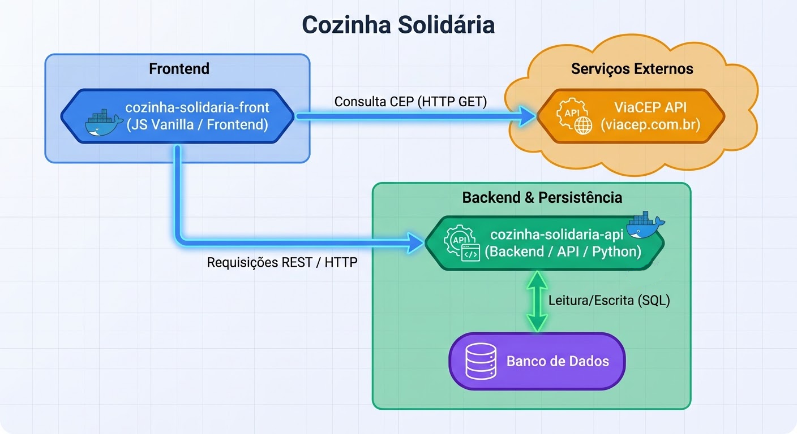

# Cozinha Solidária Frontend



Aplicação web da Cozinha Solidária. O frontend usa JavaScript nativo e Web Components, e consome a API FastAPI do projeto `cozinha-solidaria-api`.

## Requisitos

- Docker Engine
- Docker Compose v2
- Portas `8080` e `8000` disponíveis

No Linux, use `sudo` nos comandos Docker caso seu usuário não tenha acesso direto ao Docker.

## Executar a aplicação

A partir desta pasta (`cozinha-solidaria-front`), construa e inicie o frontend e a API:

```bash
sudo docker compose up --build -d
```

Acesse:

- Frontend: <http://localhost:8080>
- Documentação da API: <http://localhost:8000/docs>

Para acompanhar os logs ou parar os serviços:

```bash
sudo docker compose logs -f
sudo docker compose down
```

## Acesso administrativo inicial

Na primeira inicialização do banco, a API cria o usuário root:

- E-mail: `root@cozinhasolidaria.org`
- Senha: `root123`

Essas credenciais são apenas para desenvolvimento local. Altere-as em ambientes compartilhados ou de produção.

## Cursos e imagens

Administradores podem cadastrar cursos com nome, carga horária e data de início. A imagem é opcional: informe uma URL HTTP ou HTTPS acessível pelo navegador. Se a URL estiver vazia ou a imagem não carregar, o card exibe o ícone padrão.

## Consulta de CEP com ViaCEP

Os formulários de cadastro de usuário consultam a API pública de terceiros [ViaCEP](https://viacep.com.br/) quando o campo CEP perde o foco. O frontend remove caracteres não numéricos e só envia a consulta quando restam exatamente oito dígitos, usando o endpoint:

```text
https://viacep.com.br/ws/{cep}/json/
```

Quando o CEP é encontrado, o formulário preenche logradouro, bairro, cidade e estado (UF). Se o formato for inválido, o CEP não for encontrado ou a consulta falhar, o formulário mostra a mensagem de CEP incorreto e mantém o foco no campo para correção. Os campos de endereço continuam editáveis.

O ViaCEP é acessado diretamente pelo navegador, sem chave de API ou configuração no backend.  A integração está em `src/services/viaCep.js` e é acionada pelos formulários em `src/components/modal.js`.

```
